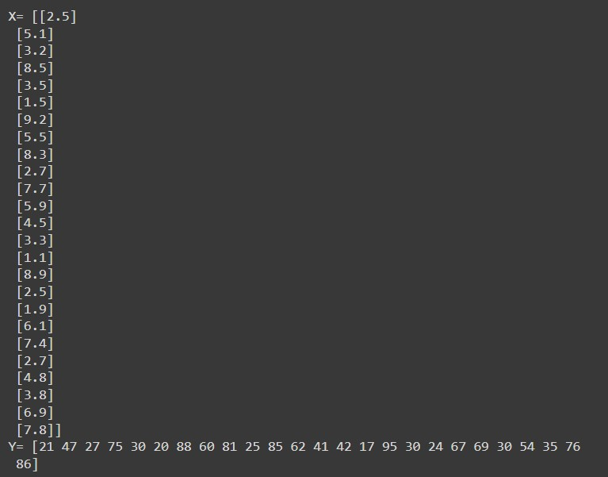
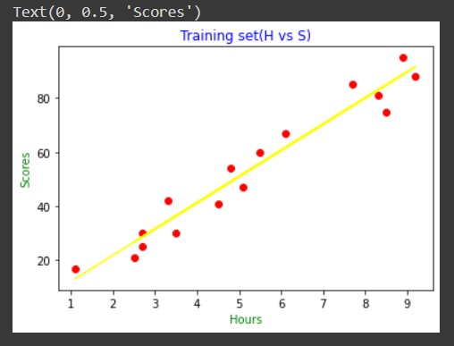
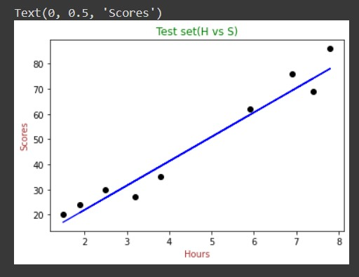
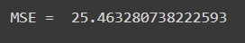
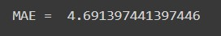
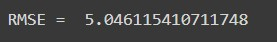

# Implementation-of-Simple-Linear-Regression-Model-for-Predicting-the-Marks-Scored

## Aim:
To write a program to predict the marks scored by a student using the simple linear regression model.

## Equipments Required:
1. Hardware – PCs
2. Anaconda – Python 3.7 Installation / Jupyter notebook

## Algorithm
### Step1:
Import the needed packages.
### Step2:
Assigning hours To X and Scores to Y.
### Step3:
Plot the scatter plot.
### Step4:
Use mse,rmse,mae formula to find.

## Program:
```
/*
Program to implement the simple linear regression model for predicting the marks scored.
Developed by: Manoj Kumar.S
RegisterNumber: 212221230056
*/
```

## Output:

### Training Set:

### Test Set:

### Mean Squared Error:

### Mean Absolute Error:

### Root Mean Squared Error:



## Result:
Thus the program to implement the simple linear regression model for predicting the marks scored is written and verified using python programming.
